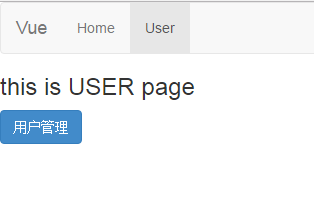

# Vue.js + RequireJS 实现组件拆分加载

作为一个后端的管理系统， 比较简单， 不想引入node， 况且其他后端同事不熟悉node。   
所以就想，有什么办法可以即使用vue，就不引入node的东西，便有了这个小实验。  
不过最终也没使用这种方式， 因为没必要 :)  ， 采用了跟简单的方式。


### 主页面js

```javascript
define(function(require) {
    // 获取vue component
    var home = require('home');
    var user = require('user');

    app = new Vue({
        el: 'body',
        data: {
            currentView: 'home'
        },
        components: {
            home: home,
            user: user
        },
        methods: {
            toggle: function() {
                if (this.currentView == 'home') {
                    this.currentView = 'user';
                } else {
                    this.currentView = 'home'
                }
            }
        }
    })
});
```


### 组件

```javascript
define(function(require) {
    var template = require('text!view/home.html');  //获取组件模板
    var v = Vue.extend({
        template: template, 
        data: function () {
            return {
                name: 'home'
            };
        },
        methods: {
            show: function (data) {
                alert(data);
            }
        }
    });

    return v;
});
```


### 截图
 
